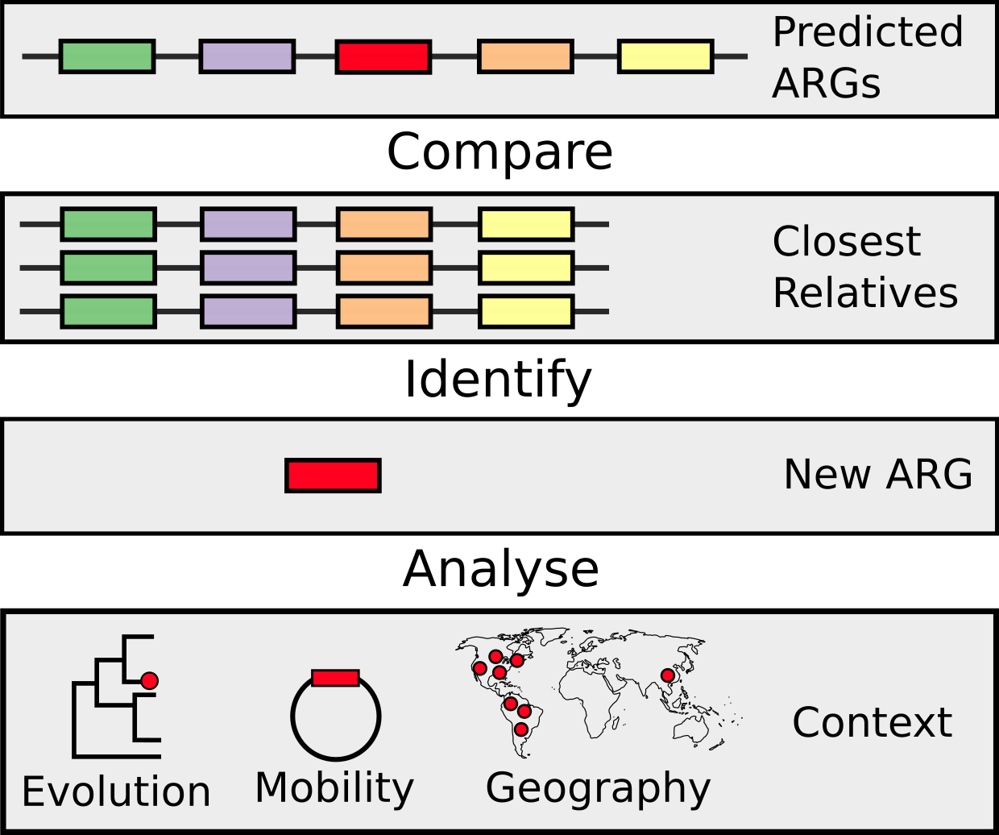
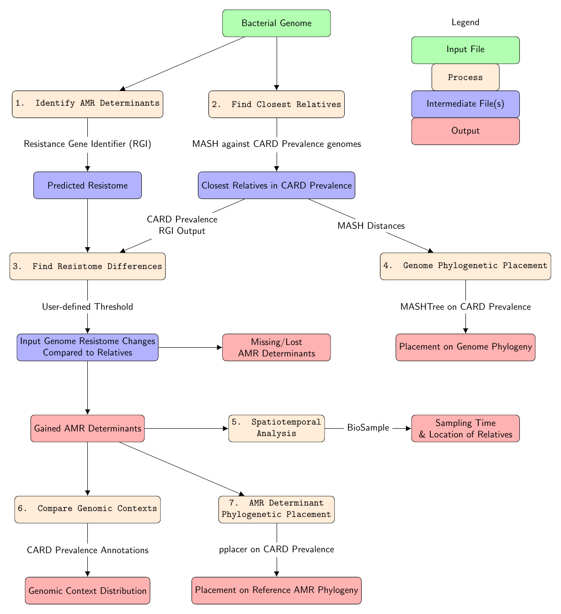

=============================
Evolving Threat Detector
=============================

.. image:: https://travis-ci.org/fmaguire/evolving_threat_detector.png?branch=master
    :target: https://travis-ci.org/fmaguire/evolving_threat_detector

Identifying changes in resistome relative to closest relatives and contextualising results

To run/test create a conda environment (or virtualenv) and run::

    pip install -r requirements.txt --editable .

Then you should be able to run::

    python etd.py

Make sure you add any new requirements you've added to the ``requirements.txt`` file

If you write then tests can be run as follows::

    pytest

Alternatively to run the full set of tests including different python versions,
pyflake code style, and building the documentation run::

    tox

Overview
--------

Output Structure
----------------

The main output directory is either specified by the user or defaults to the
input genome name followed by the UNIX timestamp

::

    test_genome_1576349112
    ├── mash
    │   └── mash_distances.tsv
    ├── rgi
    │   ├── test_genome.json
    │   └── test_genome.txt
    ├── related_isolate_geospatial_analysis_of_relatives
    └── unique_to_isolate 
        ├── amr_gene1
        │   ├── phylogenetic
        │   └── genomic_context
        └── amr_gene2
            ├── phylogenetic
            └── genomic_context

External Dependencies
---------------------

- MASH
- PPLACER
- HHMER
- e-utils

Database Preparation
--------------------

The database can be built from CARD prevalence sequences i.e. a directory
containing a set of directories for each taxa you want to include.

::

    card_prevalence
    ├── genomes                                 # directory containing all CARD-prevalence genomes
    |   |── Klebsiella_pneumoniae_NCBI_May2020
    |   |   ├── NZ_NGWN01_wgs.fa
    |   |   └── NZ_NIDM01000036.1_plasmid.fa
    │   └── Klebsiella_oxytoca_NCBI_May2020
    |       ├── NZ_CP029128.1_chromosome.fa
    |       └── NZ_CP033845.1_plasmid.fa
    ├── rgi_results                             # directory containing all RGI outputs with the same name as the genomes
    |   |── Klebsiella_pneumoniae_NCBI_May2020
    |   |   ├── NZ_NGWN01_wgs.txt
    |   |   └── NZ_NIDM01000036.1_plasmid.txt
    │   └── Klebsiella_oxytoca_NCBI_May2020
    |       ├── NZ_CP029128.1_chromosome.txt
    |       └── NZ_CP033845.1_plasmid.txt
    ├── card                                    # directory containing the version of CARD canonical and prevalence used                        
    |   |── card-data  
    |   └── card-prevalence
    └── etd_db                                  # etd specific generated files
        |── etd_db_index.json                   # index for database
        |── card_prev.msh                       # mash sketch of all the genomes in CARD prevalence (i.e. genomes folder)
        |── genome_trees                        # directory containing all generated genome phylogenies 
        |   ├── genome_trees_index.json         # index linking accessions to their specific tree
        |   ├── Klebsiella_pneumoniae_NCBI_May2020.mashtree
        |   └── Klebsiella_oxytoca_NCBI_May2020.mashtree    
        └── amr_phylogenies                     # directory containing all clustered CARD+CARD-Prevalence phylogenies
            ├── amr_phylogenies_index.json      # index linking AROs to clusters
            └── cluster1.tree
            └── cluster2.tree
                 

Detailed Workflow
=================

