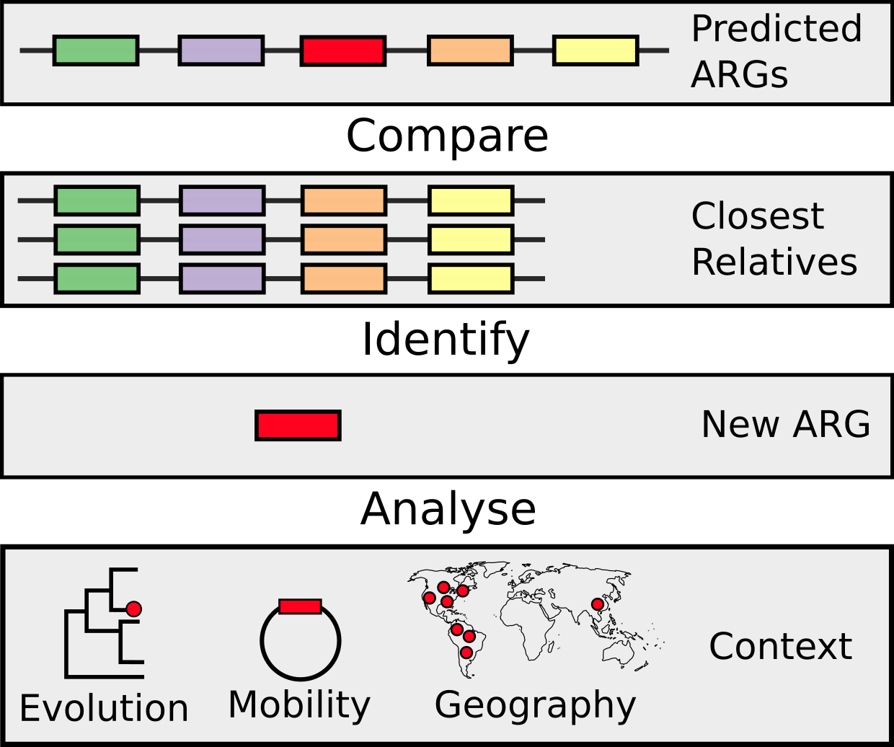

=============================
Evolving Threat Detector
=============================

.. image:: https://travis-ci.org/fmaguire/evolving_threat_detector.png?branch=master
    :target: https://travis-ci.org/fmaguire/evolving_threat_detector

Identifying changes in resistome relative to closest relatives and contextualising results

To run/test create a conda environment (or virtualenv) and run::

    pip install -r requirements.txt --editable .

Then you should be able to run::

    python etd.py

Make sure you add any new requirements you've added to the ``requirements.txt`` file

If you write then then tests can be run as follows::

    pytest

Alternatively to run the full set of tests including different python versions,
pyflake code style, and building the documentation run::

    tox

Overview
--------

Output Structure
----------------

The main output directory is either specified by the user or defaults to the
input genome name followed by the UNIX timestamp

::

    test_genome_1576349112
    ├── mash
    │   └── mash_distances.tsv
    ├── rgi
    │   ├── test_genome.json
    │   └── test_genome.txt
    └── unique_to_isolate 
        ├── amr_gene1
        │   ├── phylogenetic
        │   ├── genomic_context
        │   └── geospaital
        └── amr_gene2
            ├── phylogenetic
            ├── genomic_context
            └── geospaital

External Dependencies
---------------------

- MASH
- PPLACER
- HHMER
- e-utils

